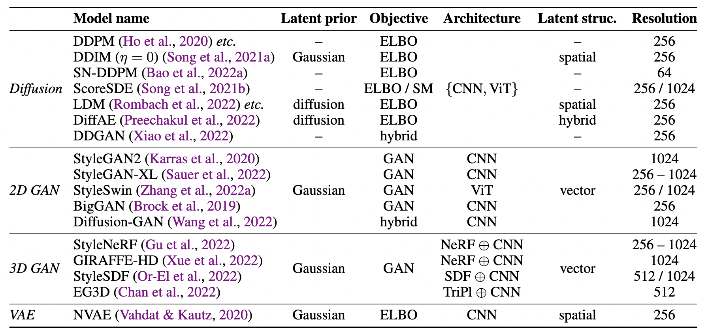
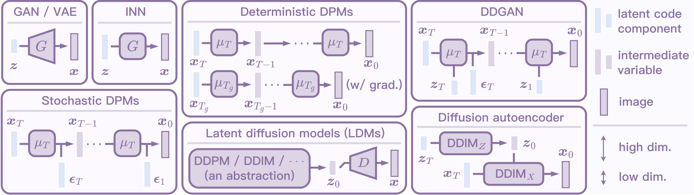
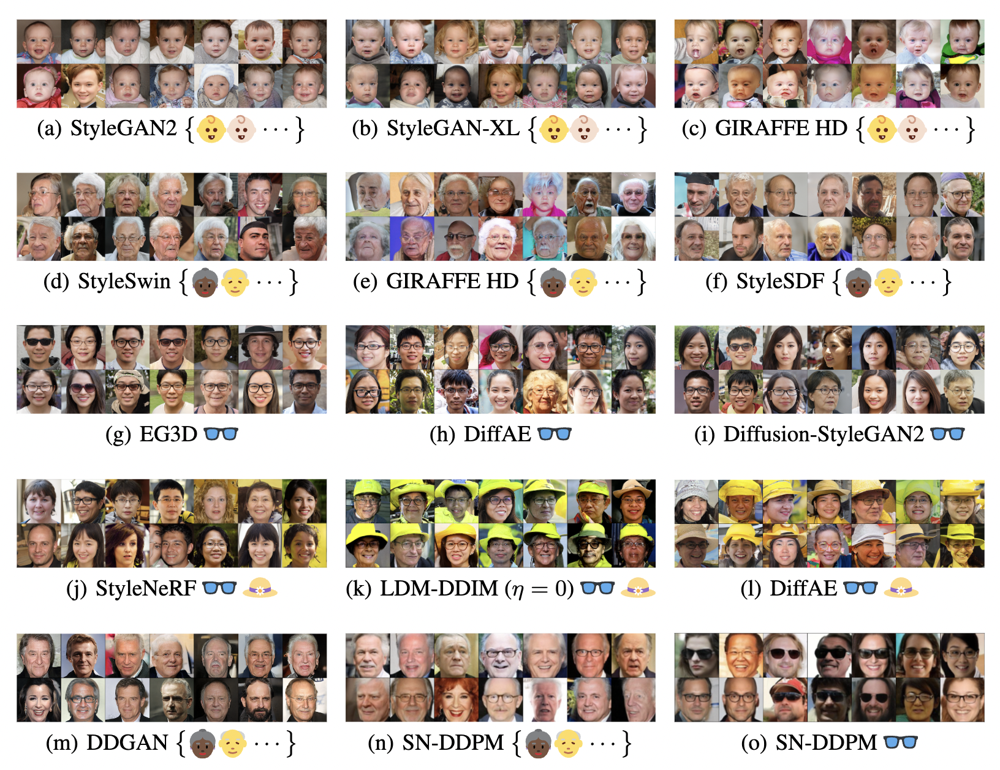
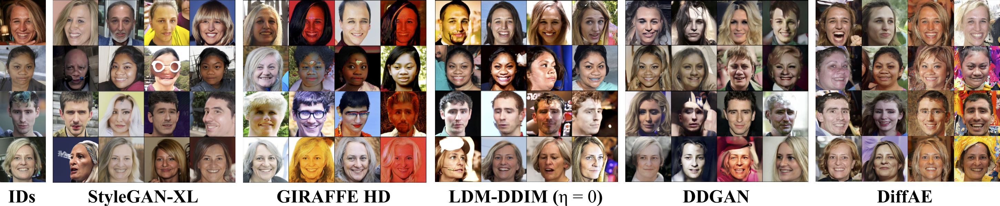

# A Unified Interface for Guiding Generative Models <br> (2D/3D GANs, Diffusion Models, and Their Variants)

Official PyTorch implementation of (**Section 4.3** of) our paper <br>
**Unifying Diffusion Models' Latent Space, with Applications to CycleDiffusion and Guidance** <br>
Chen Henry Wu, Fernando De la Torre <br>
Carnegie Mellon University <br>
_Preprint, Oct 2022_

[**[Paper link]**](https://arxiv.org/abs/2210.05559)

## Notes
1. **Sections 4.1** and **4.2** of this paper is open-sourced at [CycleDiffusion](https://github.com/ChenWu98/cycle-diffusion).
2. The code is based on [Generative Visual Prompt](https://github.com/ChenWu98/Generative-Visual-Prompt).
3. Feel free to email me if you think I should cite your work! 

## Overview

GANs, VAEs, and normalizing flows are usually characterized as deterministic mappings from **isometric Gaussian** latent codes to images. 
We show that it is possible to unify various diffusion models into this formulation. 
This allows us to guide (or condition, control) various generative models in a **unified, plug-and-play manner** by leveraging latent-space energy-based models (EBMs). 
This repository provides a unified interface for guiding various generative models with CLIP, classifiers, and face IDs. 

Models studied in this paper (some of them are not included here; please check [CycleDiffusion](https://github.com/ChenWu98/cycle-diffusion)):

<div align=center>
    
</div>

<br>

An illustration of generative models as deterministic mappings from isometric Gaussian latent codes to images. 

<div align=center>
    
</div>

<br>

Interestingly, we find that different models represent subpopulations and individuals in different ways, although most of them are trained on the same data. 

<div align=center>
    
</div>

<br>

<div align=center>
    
</div>

## Contents

- [A Unified Interface for Guiding Generative Models <br> (2D/3D GANs, Diffusion Models, and Their Variants)](#a-unified-interface-for-guiding-generative-models--2d3d-gans-diffusion-models-and-their-variants)
  - [Notes](#notes)
  - [Overview](#overview)
  - [Contents](#contents)
  - [Dependencies](#dependencies)
  - [Citation](#citation)
  - [License](#license)
  - [Contact](#contact)

## Dependencies

1. Create environment by running
```shell
conda env create -f environment.yml
conda activate generative_prompt
pip install git+https://github.com/openai/CLIP.git
```
2. Install `torch` and `torchvision` based on your CUDA version. 
3. Install [PyTorch 3D](https://github.com/facebookresearch/pytorch3d). Installing this library can be painful, but you can skip it if you are not using 3D GANs.
4. Install [taming-transformers](https://github.com/CompVis/taming-transformers) by running
```shell
cd ../
git clone git@github.com:CompVis/taming-transformers.git
cd taming-transformers/
pip install -e .
cd ../
```
5. Set up [wandb](https://wandb.ai/) for logging (registration is required). You should modify the ```setup_wandb``` function in ```main.py``` to accomodate your wandb credentials. You may want to run something like
```shell
wandb login
```


## Citation
If you find this repository helpful, please cite as
```
@inproceedings{unifydiffusion2022,
  title={Unifying Diffusion Models' Latent Space, with Applications to {CycleDiffusion} and Guidance},
  author={Chen Henry Wu and Fernando De la Torre},
  booktitle={ArXiv},
  year={2022},
}
```

## License
We use the X11 License. This license is identical to the MIT License, but with an extra sentence that prohibits using the copyright holders' names (Carnegie Mellon University in our case) for advertising or promotional purposes without written permission.


## Contact
[Issues](https://github.com/ChenWu98/unified-generative-zoo/issues) are welcome if you have any question about the code. 
If you would like to discuss the method, please contact [Chen Henry Wu](https://github.com/ChenWu98).

<a href="https://github.com/ChenWu98"></a>
